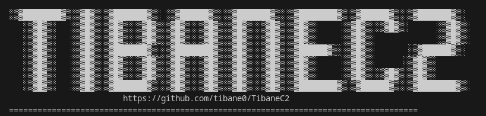

# 🚧 Project Under Construction 🚧

> ⚠️ This project is currently a work in progress.  
> Most features are not yet implemented, but updates will come soon.  
> 
> Stay tuned for development progress and new commits!

---

# TibaneC2 - Command & Control Framework




**TibaneC2** is a fully custom-built Command & Control (C2) framework designed for offensive security research, red teaming, and adversary simulation. It includes a native C/C++ core server, a PHP-based web panel, a CLI console, cross-platform implants, multi-language stagers, and scripting tools for automation and emulation.

> ⚠️ For educational and authorized testing purposes only.

The goal is to keep the C2 framework modular by splitting it into clear components, where each component will follow a defined interface so I can swap or add features easily, That way i can extend it without touching the core logic.

[Getting Started](./docs/Getting%20Started.md)

---

## Project Components

| Component      | Language(s)                     | Description |
|----------------|----------------------------------|-------------|
| **Core Server** | C                           | Central server that communicates with implants and operator interfaces |
| **Web Panel**   | PHP                              | Web-based control interface for managing agents and sending tasks |
| **CLI Console** | C++                               | Terminal-based operator tool for environments without a GUI |
| **Implants**    | C, C++ ,Python, Powershell, Bash                            | Persistent agents that execute commands and exfiltrate data |
| **Stagers**     | Assembly, C, Python, Bash, PowerShell | Lightweight loaders to deploy implants |
| **Database**    | MySQL              | Tracks agents, tasks, results, logs |
| **Automation**  | Python / Bash                    | Tools for payload generation, system health checks, and threat simulation |

---

## Architecture Overview

```yaml
[ Web Panel (PHP) ] ┐
                    |
                    | (https)              
                    |                  
                    |--------├──> [ Tibane C2 Core Server (C++) ] <──> [ Implant (C++) ]
                    |
                    | (mTLS)
[ CLI Console (C) ] ┘                                                   ▲
                                                                        │
                                                                        [ Stagers (ASM/C/PS/Py/Bash) ]
```

## Directory Structure
 ```yaml

TibaneC2/
├── core/ # C Core server logic
├── web-panel/ # Web panel (PHP)
├── console/ # CLI console (C++)
├── implants/ # Cross-platform agents
├── stagers/ # Initial access payloads
├── db/ # Database setup/scripts
├── scripts/ # Automation tools
├── docs/ # Diagrams and documentation
└── README.md # Project descriptiion
 ```

## Features

- Multi-agent support with task queueing
- CLI and Web-based control interfaces
- Encrypted C2 communication (planned: AES/TLS)
- File upload/download and command execution
- Stagers for rapid deployment
- Persistent implant options (Windows & Linux)
- Central logging, audit trail, and command results
- Payload obfuscation and delivery automation


## Communication Methods

- **Custom TCP communication:** Communicates via custom tcp and sends data via json
### Planned
- **Encrypted TCP Communication:** Encrypt communications (ssl/tls)
- **HTTP/HTTPS:** Web traffic to blend in with normal traffic

---

## TODO
### Core server
- Session mode
- HTTP/HTTPS Communication methods
- Scripting Capabilities

### Implants
- keylogger
- screenshot capture
- file upload/download
- sandbox and vm detection checks
- kill switch for self-removal
- persistence mechanisms

---

> Legal Notice
> This project is for educational and authorized testing purposes only. Unauthorized use of this tool may violate local, state, or international laws. You are responsible for using this project ethically and legally.


## License
This project is licensed under the MIT License - see the [LICENSE](LICENSE) file for details.
